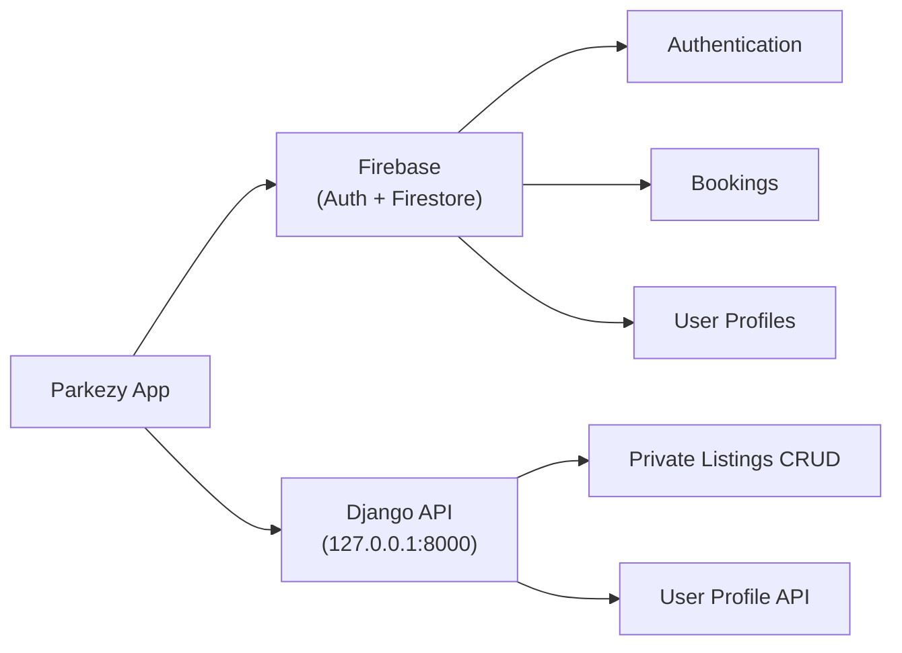
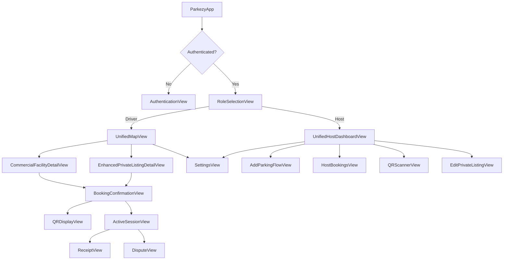

# Parkezy 2.0 — Full Codebase Audit Report

> **Date:** May 2026 | **Mode:** Read-Only Analysis | **No files modified**

---

## 1. PROJECT STRUCTURE

### 1.1 File Inventory

| # | File | Lines | Category |
|---|------|------:|----------|
| 1 | [ParkezyApp.swift](file:///Users/kartik/Documents/Parkezy-2.0/Parkezy/ParkezyApp.swift) | 46 | App Entry |
| 2 | [RoleSelectionView.swift](file:///Users/kartik/Documents/Parkezy-2.0/Parkezy/RoleSelectionView.swift) | 367 | View |
| 3 | [AuthenticationView.swift](file:///Users/kartik/Documents/Parkezy-2.0/Parkezy/AuthenticationView.swift) | 372 | View |
| 4 | [UnifiedMapView.swift](file:///Users/kartik/Documents/Parkezy-2.0/Parkezy/UnifiedMapView.swift) | 454 | View |
| 5 | [UnifiedHostDashboardView.swift](file:///Users/kartik/Documents/Parkezy-2.0/Parkezy/UnifiedHostDashboardView.swift) | 442 | View |
| 6 | [HomeMapView.swift](file:///Users/kartik/Documents/Parkezy-2.0/Parkezy/HomeMapView.swift) | 385 | View |
| 7 | [ActiveSessionView.swift](file:///Users/kartik/Documents/Parkezy-2.0/Parkezy/ActiveSessionView.swift) | 602 | View |
| 8 | [BookingConfirmationView.swift](file:///Users/kartik/Documents/Parkezy-2.0/Parkezy/BookingConfirmationView.swift) | 471 | View |
| 9 | [BookingDetailView.swift](file:///Users/kartik/Documents/Parkezy-2.0/Parkezy/BookingDetailView.swift) | 179 | View |
| 10 | [CommercialFacilityDetailView.swift](file:///Users/kartik/Documents/Parkezy-2.0/Parkezy/CommercialFacilityDetailView.swift) | 650 | View |
| 11 | [PrivateListingDetailView.swift](file:///Users/kartik/Documents/Parkezy-2.0/Parkezy/PrivateListingDetailView.swift) | 800 | View |
| 12 | [EnhancedPrivateListingDetailView.swift](file:///Users/kartik/Documents/Parkezy-2.0/Parkezy/EnhancedPrivateListingDetailView.swift) | 819 | View |
| 13 | [AddParkingFlowView.swift](file:///Users/kartik/Documents/Parkezy-2.0/Parkezy/AddParkingFlowView.swift) | 1007 | View |
| 14 | [AddPrivateListingView.swift](file:///Users/kartik/Documents/Parkezy-2.0/Parkezy/AddPrivateListingView.swift) | 146 | View |
| 15 | [EditPrivateListingView.swift](file:///Users/kartik/Documents/Parkezy-2.0/Parkezy/EditPrivateListingView.swift) | 302 | View |
| 16 | [PricingIntelligenceView.swift](file:///Users/kartik/Documents/Parkezy-2.0/Parkezy/PricingIntelligenceView.swift) | 279 | View |
| 17 | [SpotDetailSheet.swift](file:///Users/kartik/Documents/Parkezy-2.0/Parkezy/SpotDetailSheet.swift) | 372 | View |
| 18 | [SettingsView.swift](file:///Users/kartik/Documents/Parkezy-2.0/Parkezy/SettingsView.swift) | 569 | View |
| 19 | [QRScannerView.swift](file:///Users/kartik/Documents/Parkezy-2.0/Parkezy/QRScannerView.swift) | 594 | View |
| 20 | [QRDisplayView.swift](file:///Users/kartik/Documents/Parkezy-2.0/Parkezy/QRDisplayView.swift) | 414 | View |
| 21 | [PINEntryView.swift](file:///Users/kartik/Documents/Parkezy-2.0/Parkezy/PINEntryView.swift) | 364 | View |
| 22 | [ReceiptView.swift](file:///Users/kartik/Documents/Parkezy-2.0/Parkezy/ReceiptView.swift) | 495 | View |
| 23 | [DisputeView.swift](file:///Users/kartik/Documents/Parkezy-2.0/Parkezy/DisputeView.swift) | 436 | View |
| 24 | [HostBookingsView.swift](file:///Users/kartik/Documents/Parkezy-2.0/Parkezy/HostBookingsView.swift) | 160 | View |
| 25 | [LocationPickerView.swift](file:///Users/kartik/Documents/Parkezy-2.0/Parkezy/LocationPickerView.swift) | 207 | View |
| 26 | [MapView.swift](file:///Users/kartik/Documents/Parkezy-2.0/Parkezy/MapView.swift) | 48 | View |
| 27 | [SkeletonView.swift](file:///Users/kartik/Documents/Parkezy-2.0/Parkezy/SkeletonView.swift) | 97 | Component |
| 28 | [DesignSystem.swift](file:///Users/kartik/Documents/Parkezy-2.0/Parkezy/DesignSystem.swift) | 228 | Design |
| 29 | [MapViewModel.swift](file:///Users/kartik/Documents/Parkezy-2.0/Parkezy/MapViewModel.swift) | 211 | ViewModel |
| 30 | [BookingViewModel.swift](file:///Users/kartik/Documents/Parkezy-2.0/Parkezy/BookingViewModel.swift) | 279 | ViewModel |
| 31 | [HostViewModel.swift](file:///Users/kartik/Documents/Parkezy-2.0/Parkezy/HostViewModel.swift) | 442 | ViewModel |
| 32 | [CommercialParkingViewModel.swift](file:///Users/kartik/Documents/Parkezy-2.0/Parkezy/CommercialParkingViewModel.swift) | 396 | ViewModel |
| 33 | [PrivateParkingViewModel.swift](file:///Users/kartik/Documents/Parkezy-2.0/Parkezy/PrivateParkingViewModel.swift) | 896 | ViewModel |
| 34 | [ParkingSpot.swift](file:///Users/kartik/Documents/Parkezy-2.0/Parkezy/ParkingSpot.swift) | 88 | Model |
| 35 | [BookingSession.swift](file:///Users/kartik/Documents/Parkezy-2.0/Parkezy/BookingSession.swift) | 96 | Model |
| 36 | [User.swift](file:///Users/kartik/Documents/Parkezy-2.0/Parkezy/User.swift) | 51 | Model |
| 37 | [PrivateParking.swift](file:///Users/kartik/Documents/Parkezy-2.0/Parkezy/PrivateParking.swift) | 324 | Model |
| 38 | [CommercialParking.swift](file:///Users/kartik/Documents/Parkezy-2.0/Parkezy/CommercialParking.swift) | 233 | Model |
| 39 | [DisputeReport.swift](file:///Users/kartik/Documents/Parkezy-2.0/Parkezy/DisputeReport.swift) | 29 | Model |
| 40 | [MockDataService.swift](file:///Users/kartik/Documents/Parkezy-2.0/Parkezy/MockDataService.swift) | 454 | Service |
| 41 | [LocationManager.swift](file:///Users/kartik/Documents/Parkezy-2.0/Parkezy/LocationManager.swift) | 232 | Service |
| 42 | [NotificationManager.swift](file:///Users/kartik/Documents/Parkezy-2.0/Parkezy/NotificationManager.swift) | 131 | Service |
| 43 | [QRCodeService.swift](file:///Users/kartik/Documents/Parkezy-2.0/Parkezy/QRCodeService.swift) | 75 | Service |
| 44 | [EmulatorDetector.swift](file:///Users/kartik/Documents/Parkezy-2.0/Parkezy/EmulatorDetector.swift) | 24 | Utility |
| 45 | [FindParkingIntent.swift](file:///Users/kartik/Documents/Parkezy-2.0/Parkezy/FindParkingIntent.swift) | 158 | Siri/Intents |
| 46 | [ParkingLiveActivity.swift](file:///Users/kartik/Documents/Parkezy-2.0/Parkezy/ParkingLiveActivity.swift) | 374 | LiveActivity |
| 47 | [ParkingWidget.swift](file:///Users/kartik/Documents/Parkezy-2.0/Parkezy/ParkingWidget.swift) | 322 | Widget |
| **Backend/** | | | |
| 48 | [AppConfig.swift](file:///Users/kartik/Documents/Parkezy-2.0/Parkezy/Backend/AppConfig.swift) | 34 | Config |
| 49 | [AppDelegate.swift](file:///Users/kartik/Documents/Parkezy-2.0/Parkezy/Backend/AppDelegate.swift) | 23 | Lifecycle |
| 50 | [AppUser.swift](file:///Users/kartik/Documents/Parkezy-2.0/Parkezy/Backend/AppUser.swift) | 96 | Model |
| 51 | [FirebaseManager.swift](file:///Users/kartik/Documents/Parkezy-2.0/Parkezy/Backend/FirebaseManager.swift) | 98 | Infra |
| 52 | [AuthRepository.swift](file:///Users/kartik/Documents/Parkezy-2.0/Parkezy/Backend/AuthRepository.swift) | 246 | Auth |
| 53 | [AuthViewModel.swift](file:///Users/kartik/Documents/Parkezy-2.0/Parkezy/Backend/AuthViewModel.swift) | 218 | Auth |
| 54 | [UserRepository.swift](file:///Users/kartik/Documents/Parkezy-2.0/Parkezy/Backend/UserRepository.swift) | 194 | Repository |
| 55 | [BookingRepository.swift](file:///Users/kartik/Documents/Parkezy-2.0/Parkezy/Backend/BookingRepository.swift) | 514 | Repository |
| 56 | [PrivateListingRepository.swift](file:///Users/kartik/Documents/Parkezy-2.0/Parkezy/Backend/PrivateListingRepository.swift) | 405 | Repository |
| 57 | [CommercialFacilityRepository.swift](file:///Users/kartik/Documents/Parkezy-2.0/Parkezy/Backend/CommercialFacilityRepository.swift) | 376 | Repository |
| 58 | [ParkingAPIService.swift](file:///Users/kartik/Documents/Parkezy-2.0/Parkezy/Backend/ParkingAPIService.swift) | 508 | API Client |

**Total: 58 Swift files · 18,832 lines of code**

### 1.2 Resources & Assets

| Path | Contents |
|------|----------|
| `Assets.xcassets/AppIcon.appiconset/` | App icon (Contents.json only — **no icon images present**) |
| `Assets.xcassets/AccentColor.colorset/` | Accent color definition |
| `Assets.xcassets/parking_city_bg.imageset/` | Background image for role selection |
| `README.md` | Project README (6,927 bytes) |

### 1.3 Missing Infrastructure Files

> [!CAUTION]
> No `.xcodeproj`, `.xcworkspace`, `Package.swift`, `Podfile`, `Info.plist`, `GoogleService-Info.plist`, or `.entitlements` files were found in the repository. Dependencies are likely managed via Xcode SPM integration (not committed).

---

## 2. DEPENDENCIES

### 2.1 Import Frequency Analysis

| Framework | Import Count | Files Using It |
|-----------|:---:|---|
| `SwiftUI` | 38 | Nearly all views/VMs |
| `Foundation` | 20 | Models, services, repos |
| `CoreLocation` | 19 | Maps, models, repos |
| `Combine` | 13 | ViewModels, repos |
| `MapKit` | 9 | Map views |
| `FirebaseFirestore` | 7 | All repositories + AppUser |
| `FirebaseAuth` | 5 | AuthRepo, AuthVM, ParkingAPIService, PrivateParkingVM, FirebaseManager |
| `FirebaseCore` | 2 | AppDelegate, FirebaseManager |
| `AuthenticationServices` | 3 | Apple Sign-In |
| `UIKit` | 2 | QR code service |
| `WidgetKit` | 2 | Widget |
| `AppIntents` | 2 | Siri shortcuts |
| `CoreImage.CIFilterBuiltins` | 2 | QR generation |
| `UserNotifications` | 1 | NotificationManager |
| `PhotosUI` | 1 | Photo picker |
| `VisionKit` | 1 | QR scanning |
| `CryptoKit` | 1 | Nonce hashing (Apple Sign-In) |
| `ActivityKit` | 1 | Live Activities |

### 2.2 Dependency Status

| Dependency | Status | Notes |
|------------|--------|-------|
| **Firebase (Auth, Firestore, Core)** | ✅ ACTIVE | Core backend — used in 14 files |
| **WidgetKit** | ⚠️ PARTIALLY USED | `ParkingWidget.swift` exists but no widget target confirmed |
| **ActivityKit** | ⚠️ PARTIALLY USED | `ParkingLiveActivity.swift` exists but calls are stubs in `BookingViewModel` |
| **AppIntents** | ⚠️ PARTIALLY USED | `AppShortcutsProvider` is **fully commented out** (lines 82-130) |

---

## 3. BACKEND IDENTIFICATION

### 3.1 Dual-Backend Architecture

### 3.2 API Surface — Django Backend

**Base URL:** `http://127.0.0.1:8000/api` (hardcoded in [ParkingAPIService.swift:14](file:///Users/kartik/Documents/Parkezy-2.0/Parkezy/Backend/ParkingAPIService.swift#L14))

| Method | Endpoint | Purpose |
|--------|----------|---------|
| `GET` | `/parking/private-listings/` | Fetch all private listings |
| `POST` | `/parking/private-listings/` | Create a new listing |
| `GET` | `/users/me/` | Get current user profile |
| `PUT` | `/parking/private-listings/{id}/` | Update a listing |
| `GET` | `/parking/commercial-facilities/` | Fetch commercial facilities |
| `POST` | `/parking/commercial-facilities/` | Create a commercial facility |

**Auth:** Firebase ID token passed as `Authorization: Bearer <token>`

### 3.3 API Surface — Firebase/Firestore

| Collection | Repository | Operations |
|------------|-----------|------------|
| `users` | `UserRepository` | CRUD, capability mgmt, stats |
| `bookings` | `BookingRepository` | Create, approve/reject, start/end session, cancel |
| `privateListings` | `PrivateListingRepository` | CRUD, slot mgmt, availability |
| `commercialFacilities` | `CommercialFacilityRepository` | CRUD, capacity mgmt (with transactions) |

### 3.4 Authentication Flow

| Method | Implementation |
|--------|---------------|
| **Email/Password** | `AuthRepository.signUp/signIn` → Firebase Auth → Firestore user doc |
| **Apple Sign-In** | `AuthRepository.handleAppleSignIn` → nonce + credential → Firebase Auth |
| **Token Refresh** | `ParkingAPIService.getAuthToken()` — calls `Auth.auth().currentUser?.getIDToken()` |
| **State Management** | `AuthViewModel` listens to `Auth.addStateDidChangeListener` |

---

## 4. CRASH RISK ANALYSIS

### 4.1 Force Unwraps (`!`) — Crash Candidates

> [!WARNING]
> The following lines will crash at runtime if values are `nil`.

| File | Line | Expression | Risk |
|------|:----:|------------|------|
| [ParkingAPIService.swift](file:///Users/kartik/Documents/Parkezy-2.0/Parkezy/Backend/ParkingAPIService.swift#L42) | 42 | `URL(string: "\(baseURL)/...")!` | 🔴 **HIGH** — crashes if baseURL is malformed |
| Same file | 99, 154, 178, 204, 261 | Same pattern (6 occurrences) | 🔴 **HIGH** |
| [SettingsView.swift](file:///Users/kartik/Documents/Parkezy-2.0/Parkezy/SettingsView.swift#L519) | 519-522 | `URL(string: "tel:...")!`, `URL(string: "mailto:...")!` | 🟡 Medium — static strings, unlikely to fail |
| [FindParkingIntent.swift](file:///Users/kartik/Documents/Parkezy-2.0/Parkezy/FindParkingIntent.swift#L21) | 21, 35 | `URL(string: "parkezy://...")!` | 🟡 Medium — static deep links |
| [AuthRepository.swift](file:///Users/kartik/Documents/Parkezy-2.0/Parkezy/Backend/AuthRepository.swift#L230) | 230 | `fatalError("Unable to generate nonce")` | 🔴 **HIGH** — kills the app |
| [LocationPickerView.swift](file:///Users/kartik/Documents/Parkezy-2.0/Parkezy/LocationPickerView.swift#L27) | 27 | `markerPosition!` inside conditional | 🟡 Medium — guarded by `!= nil` check |

### 4.2 TODOs & Incomplete Code

| File | Line | Comment |
|------|:----:|---------|
| [PrivateParkingViewModel.swift](file:///Users/kartik/Documents/Parkezy-2.0/Parkezy/PrivateParkingViewModel.swift#L806) | 806 | `// TODO: Format dates if needed` |
| [PrivateParkingViewModel.swift](file:///Users/kartik/Documents/Parkezy-2.0/Parkezy/PrivateParkingViewModel.swift#L855) | 855 | `// TODO: Sync with backend when API is ready` (delete listing) |

### 4.3 No `try!` usage found ✅

---

## 5. ORPHANED / UNUSED CODE

### 5.1 Potentially Orphaned Views

| View | Referenced By | Status |
|------|-------------|--------|
| `AddPrivateListingView` | **Nothing** | 🔴 **ORPHANED** — never instantiated |
| `BookingDetailView` | **Nothing** | 🔴 **ORPHANED** — never instantiated |
| `PricingIntelligenceView` | **Nothing** | 🔴 **ORPHANED** — never instantiated |
| `ParkingLiveActivity` | Only stub calls in BookingVM | ⚠️ **DEAD CODE** — no ActivityKit integration |
| `ParkingWidget` | No widget target found | ⚠️ **DEAD CODE** — no extension target |
| `HomeMapView` | Not in navigation graph (replaced by `UnifiedMapView`) | ⚠️ **LIKELY ORPHANED** |
| `MapView` (UIKit wrapper) | Not referenced anywhere | 🔴 **ORPHANED** |

### 5.2 Commented-Out Code

| File | Lines | Description |
|------|-------|-------------|
| [FindParkingIntent.swift](file:///Users/kartik/Documents/Parkezy-2.0/Parkezy/FindParkingIntent.swift#L82) | 82-130 | Entire `AppShortcutsProvider` commented out |
| [RoleSelectionView.swift](file:///Users/kartik/Documents/Parkezy-2.0/Parkezy/RoleSelectionView.swift#L60) | 60-64 | Subtitle text commented out but modifiers remain |

### 5.3 Duplicate Models

| Concept | Model A | Model B | Issue |
|---------|---------|---------|-------|
| User | `User` (User.swift) | `AppUser` (AppUser.swift) | Two separate user models — `User` is used by `HostViewModel` mock data; `AppUser` is used by Firebase. **Confusing overlap.** |
| User Profile | `UserProfile` (in ParkingAPIService) | `AppUser` | Django API returns `UserProfile`, Firebase uses `AppUser` |

---

## 6. NAVIGATION GRAPH

---

## 7. SECURITY CONCERNS

| # | Issue | Severity | Location |
|---|-------|----------|----------|
| 1 | **Hardcoded localhost API URL** — `http://127.0.0.1:8000` will fail on any device | 🔴 Critical | ParkingAPIService:14 |
| 2 | **HTTP (not HTTPS)** — traffic is unencrypted | 🔴 Critical | ParkingAPIService:14 |
| 3 | **No token expiry/refresh handling** — `getAuthToken()` may return expired token | 🟡 Medium | ParkingAPIService:27 |
| 4 | **Access PINs are 6-digit random** — no server-side validation | 🟡 Medium | Multiple files |
| 5 | **No input sanitization** on user-entered listing titles/descriptions | 🟡 Medium | AddParkingFlowView |
| 6 | **Mock data hardcoded phone numbers/emails** may leak in production | 🟢 Low | HostViewModel, MockDataService |

---

## 8. CODE QUALITY SUMMARY

### 8.1 Strengths ✅

- **Clean MVVM architecture** with clear separation of Views, ViewModels, and Repositories
- **Firestore transactions** for atomic booking operations preventing race conditions
- **Design system** with centralized tokens (colors, spacing, typography, animations)
- **Geofencing** implementation with proper CLLocationManager delegate handling
- **Dual booking models** — Private (approval-based) vs Commercial (instant) properly separated
- **Error enums** (`AuthError`, `BookingError`, `UserError`) with `LocalizedError` conformance
- **Shimmer/skeleton loading** states for better UX

### 8.2 Weaknesses ⚠️

| Issue | Impact | Files Affected |
|-------|--------|----------------|
| Largest file is 1,007 LOC (`AddParkingFlowView`) | Hard to maintain | 1 |
| 7 orphaned views (~2,400 LOC of dead code) | Confusing codebase | 7 |
| Dual user models (`User` vs `AppUser`) | Identity confusion | Multiple |
| `HostViewModel` is 100% mock data with no Firebase path | Feature gap | 1 |
| `deleteListing` has no backend call (just local removal + TODO) | Data loss | PrivateParkingVM:851 |
| No unit tests found | Regression risk | Project-wide |
| No `.plist` / `xcconfig` committed | Onboarding friction | Project-wide |

---

## 9. PRIORITIZED RECOMMENDATIONS

### 🔴 P0 — Must Fix Before Any Testing

1. **Replace hardcoded `baseURL`** in `ParkingAPIService` with environment-based config (`xcconfig` or `AppConfig`)
2. **Guard all `URL(string:)!` force unwraps** — wrap in `guard let url = URL(...)` with proper error handling
3. **Replace `fatalError` in `AuthRepository.randomNonceString`** with a thrown error

### 🟡 P1 — Fix Before Production

4. **Delete orphaned views**: `AddPrivateListingView`, `BookingDetailView`, `PricingIntelligenceView`, `MapView`, `HomeMapView`
5. **Unify user models** — merge `User` and `UserProfile` into `AppUser` 
6. **Implement `deleteListing` backend call** (currently local-only with TODO)
7. **Switch to HTTPS** for Django API communication
8. **Add token refresh logic** before API calls
9. **Connect `HostViewModel`** to Firebase repositories instead of only mock data

### 🟢 P2 — Improve When Possible

10. **Break up large views** — `AddParkingFlowView` (1,007 LOC) into sub-views
11. **Remove commented-out `AppShortcutsProvider`** or implement it
12. **Add widget/LiveActivity targets** or remove `ParkingWidget.swift` and `ParkingLiveActivity.swift`
13. **Commit project infrastructure** (`.xcodeproj`, `Info.plist`, `GoogleService-Info.plist`) to the repo
14. **Add unit tests** for ViewModels and Repositories
